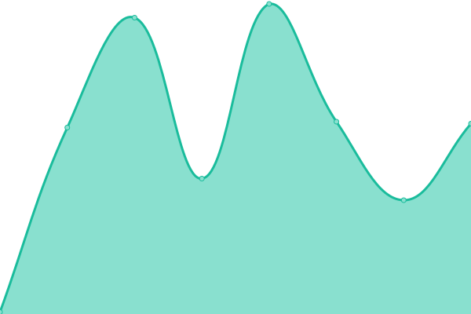
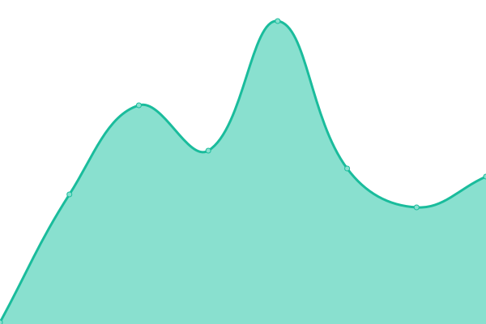

# [📈 Live Status](https://upptime.github.io/upptime): <!--live status--> **🟥 Complete outage**

This repository contains the open-source uptime monitor and status page for [Upptime](https://upptime.js.org), powered by [Upptime](https://github.com/upptime/upptime).

With [Upptime](https://upptime.js.org), you can get your own unlimited and free uptime monitor and status page, powered entirely by a GitHub repository. We use [Issues](https://github.com/upptime/upptime/issues) as incident reports, [Actions](https://github.com/felipesotero/upptime-navega/actions) as uptime monitors, and [Pages](https://upptime.github.io/upptime) for the status page.

<!--start: status pages-->
<!-- This summary is generated by Upptime (https://github.com/upptime/upptime) -->
<!-- Do not edit this manually, your changes will be overwritten -->
<!-- prettier-ignore -->
| URL | Status | History | Response Time | Uptime |
| --- | ------ | ------- | ------------- | ------ |
|  [Navega Home](https://navega.tech) | 🟥 Down | [navega-home.yml](https://github.com/felipesotero/upptime-navega/commits/HEAD/history/navega-home.yml) | 

 100ms
     
 | 

<a href="https://felipesotero.github.io/upptime-navega/history/navega-home">100.00%</a>
    

|  [Navega n8n](https://n8n.navega.tech) | 🟥 Down | [navega-n8n.yml](https://github.com/felipesotero/upptime-navega/commits/HEAD/history/navega-n8n.yml) | 

 91ms
     
 | 

<a href="https://felipesotero.github.io/upptime-navega/history/navega-n8n">100.00%</a>
    

|  [Navega Project](https://project.navega.tech) | 🟥 Down | [navega-project.yml](https://github.com/felipesotero/upptime-navega/commits/HEAD/history/navega-project.yml) | 

 109ms
     
 | 

<a href="https://felipesotero.github.io/upptime-navega/history/navega-project">100.00%</a>
    

<!--end: status pages-->

[**Visit our status website →**](https://upptime.github.io/upptime)

## 📄 License

- Powered by: [Upptime](https://github.com/upptime/upptime)
- Code: [MIT](./LICENSE) © [Anand Chowdhary](https://anandchowdhary.com), supported by [Pabio](https://pabio.com)
- Data in the `./history` directory: [Open Database License](https://opendatacommons.org/licenses/odbl/1-0/)
